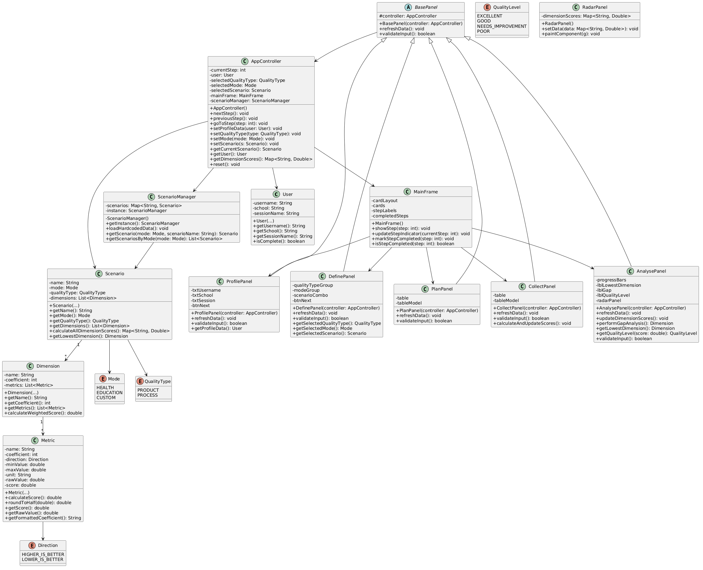

# ISO 15939 Measurement Process Simulator Requirements and Design Submission

## 1.1 Purpose
This document defines the requirements and overall system design of the ISO 15939 Measurement Process Simulator. It is a Java Swing desktop application that simulates the five core steps of the ISO/IEC 15939 measurement process:

Profile → Define → Plan → Collect → Analyse

### 1.2 Scope

The system allows users to:

Enter session information Select quality type, mode, and scenario View predefined quality dimensions and metrics Collect measurement data Analyse results using weighted averages and gap analysis

The application is implemented using Java Swing and follows the MVC architecture.

## Overall Description 
### 2.1 Product Perspective Standalone desktop application No external libraries are used All data is hard-coded Developed using Java SE 17+
### 2.2 User Characteristics Basic computer users No technical knowledge required Simple and user-friendly interface 2.3 Constraints Must compile using javac Must run using java Only Java SE standard library is allowed Must follow OOP principles Must use Swing components
Functional Requirements
### 3.1 Step 1: Profile
Inputs:

Username School Session Name

Validation Rules:

All fields are mandatory System must display clear, user-friendly (non-technical) messages The message must clearly specify which field is missing

Examples:

"Please enter your username to continue." "Please enter your school name." "Please enter a session name."

Output: User proceeds only if all fields are filled.

### 3.2 Step 2: Define Quality Dimensions 3.2.1 Quality Type Selection Product Quality Process Quality

Only one selection is allowed (RadioButton).

3.2.2 Mode Selection Health Education Custom (Bonus feature: user defines own metrics)

Requirement: At least 2 modes must exist. Custom mode is optional (bonus).

3.2.3 Scenario Selection Depends on selected mode Only one scenario can be selected

Requirement: Each mode must contain at least 2 scenarios.

### 3.3 Step 3: Plan Measurement

Description: Displays predefined dimensions and metrics.

Requirements:

Must use JTable Table must be non-editable

Displayed Columns:

Metric name Coefficient Direction (Higher ↑ / Lower ↓) Range Unit 3.4 Step 4: Collect Data

Score Calculation

For "Higher is better":

score = 1 + ((value − min) / (max − min)) × 4

For "Lower is better":

score = 5 − ((value − min) / (max − min) × 4)

Rounding Rule

Scores must be between 1.0 and 5.0 Scores must be rounded to the nearest 0.5

Implementation:

score = Math.round(score * 2) / 2.0;
### 3.5 Step 5: Analyse 
3.5.1 Dimension-Based Weighted Average dimensionScore = Σ(metricScore × metricCoefficient) / Σ(metricCoefficient)

Display Requirements:

Each dimension must be displayed using a separate JProgressBar Progress bar value = dimensionScore × 20 (since max score is 5)
3.5.2 Gap Analysis

System must:

Identify the lowest scoring dimension

Display:

Dimension name Score Gap (5.0 − score) Quality level: Excellent Good Needs Improvement Poor

Message:

"This dimension has the lowest score and requires the most improvement."

3.5.3 Radar Chart (Bonus) Optional Implemented using Graphics2D 4. Non-Functional Requirements

Usability

Simple interface Clear messages

Performance

Fast response

Reliability

No crashes

Maintainability

Clean code Proper MVC separation 5. System Design 5.1 Architecture

The system follows the MVC pattern:

Model → Data View → GUI Controller → Logic 5.2 UI Design Implemented using CardLayout Each step is a separate JPanel

Panels:

ProfilePanel DefinePanel PlanPanel CollectPanel AnalysePanel
### 5.3 Data Management All data is hard-coded Managed in a central class (e.g., ScenarioManager)
### 5.4 Collections Usage ArrayList → metrics & dimensions HashMap → scenarios

Example: Map<String, Scenario>

### 5.5 OOP Design Encapsulation Inheritance: BasePanel → parent class for all panels Polymorphism: Panels handled via a common structure
### 5.6 Class Structure

Class Diagram

Step Indicator
Displayed at the top of the interface.

Features:

Steps: Profile → Define → Plan → Collect → Analyse Active step is highlighted (color or bold) Completed steps show a ✓ check mark

Technologies Used Java SE 17 Java Swing ArrayList, HashMap MVC
